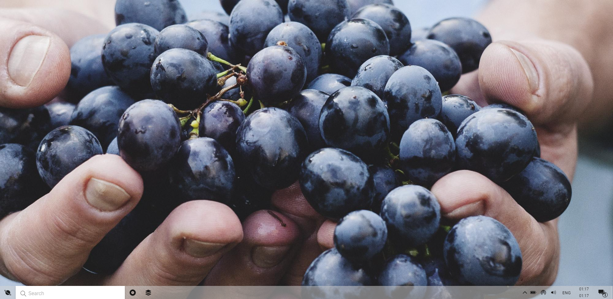
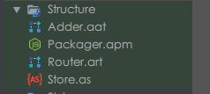
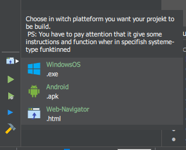

<!-- PROJECT SHIELDS -->
<!--
*** I'm using markdown "reference style" links for readability.
*** Reference links are enclosed in brackets [ ] instead of parentheses ( ).
*** See the bottom of this document for the declaration of the reference variables
*** for contributors-url, forks-url, etc. This is an optional, concise syntax you may use.
*** https://www.markdownguide.org/basic-syntax/#reference-style-links
-->
[](https://github.com/Artefact-Labs/KosmOS/issues)
[](https://github.com/Artefact-Labs/KosmOS/network)
[](https://github.com/Artefact-Labs/KosmOS/stargazers)
[](https://github.com/Artefact-Labs/KosmOS)

<!-- PROJECT LOGO -->
<br />
<p align="center">
  <a href="https://github.com/othneildrew/Best-README-Template">
    
  </a>

  <h3 align="center">KosmosOS</h3>

  <p align="center">
    An operating system working thanks to web technologies. (clone of Windows 10).
    <br />
    <a href="https://doc.artefact-labs.com"><strong>Explore the Artefact's docs »</strong></a>
    <br />
    <br />
    <a href="https://awesome.artefact-labs.com/kosmos">View Demo</a>
    ·
    <a href="https://github.com/Artefact-Labs/KosmOS/issues">Report Bug</a>
    ·
    <a href="https://github.com/Artefact-Labs/KosmOS/issues">Request Feature</a>
  </p>
</p>


<!-- TABLE OF CONTENTS -->
<details open="open">
  <summary>Table of Contents</summary>
  <ol>
    <li>
      <a href="#about-the-project">About The Project</a>
      <ul>
        <li><a href="#built-with">Built With</a></li>
      </ul>
    </li>
    <li>
      <a href="#getting-started">Getting Started</a>
      <ul>
        <li><a href="#prerequisites">Prerequisites</a></li>
        <li><a href="#installation">Installation</a></li>
      </ul>
    </li>
    <li><a href="#roadmap">Roadmap</a></li>
    <li><a href="#contributing">Contributing</a></li>
    <li><a href="#license">License</a></li>
    <li><a href="#contact">Contact</a></li>
    <li><a href="#acknowledgements">Acknowledgements</a></li>
  </ol>
</details>


<!-- ABOUT THE PROJECT -->
## About The Project

[](https://awesome.artefact-labs.com/kosmos)
This project was set up in order to present the extent of the capabilities of Artefact and Artefact-Creator.
It is a replica of the Windows 10 operating system.
But it also has a utilitarian aspect:
- Allows users to add their own applications to the site
- Allow to make their web applications better known

A list of used libraries is listed in the acknowledgements.


### Built With

This section should list any major frameworks that you built your project using. Add-ons/plugins are in the acknowledgements section.
* [JQuery](https://jquery.com)


<!-- GETTING STARTED -->
## Getting Started

To be able to compile the project by yourself here are the steps to follow.

### Prerequisites

First of all you need to have some infrastructure already installed on your machine.
* npm
  ```sh
  npm install npm@latest -g
  ```
  Or install [Node.js](https://nodejs.org/en/) in your computer.

* Artefact-Creator: This is the official IDE of the Artifact language. You can download it from its [official website](https://artefact-labs.com/pricing).

### Installation

1. Clone the repo
   ```sh
   git clone https://github.com/Artefact-Labs/KosmOS.git
   ```
2. Open the cloned project with Artefact-Creator.
3. In the IDE open the **Packager.apm** file and install all the packages. 
4. Choose the platform for which you would like to compile. 
3. It is done. Just click on the **run** button  and wait the build process to finish.

<!-- ROADMAP -->
## Roadmap
- [ ] LogIn Screen
- [ ] SignIn Screen
- [x] Eplorer (main office)
- [ ] Start menu
- [ ] File explorer
- [ ] Simple Window
- [ ] Application registration
- [ ] Setting Screen


<!-- CONTRIBUTING -->
## Contributing

Contributions are what make the open source community such an amazing place to be learn, inspire, and create. Any contributions you make are **greatly appreciated**.

1. Fork the Project
2. Create your Feature Branch (`git checkout -b feature/AmazingFeature`)
3. Commit your Changes (`git commit -m 'Add some AmazingFeature'`)
4. Push to the Branch (`git push origin feature/AmazingFeature`)
5. Open a Pull Request


<!-- LICENSE -->
## License

Distributed under the MIT License. See `LICENSE` for more information.


<!-- CONTACT -->
## Contact

Artefact-Team - [@Artefact_official](https://twitter.com/Artefactoffici1) - contact@artefact-labs.com

Official Website: [https://artefact-labs.com](https://artefact-labs.com)


<!-- ACKNOWLEDGEMENTS -->
## Acknowledgements
* [Animate.css](https://daneden.github.io/animate.css)
* [Vue.js](https://vuejs.org/)
